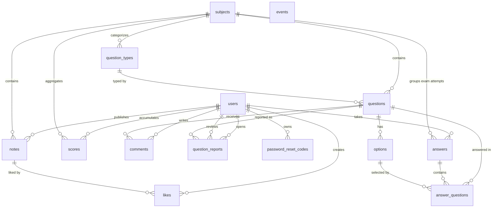

# Database Schema Documentation

This document reflects the Lucid migrations in [`database/migrations/`](../database/migrations) and the ORM models in [`app/models/`](../app/models).

## Overview

- Database engine: PostgreSQL
- ORM: Lucid ORM
- Migration entry point: `node ace migration:run`
- Core domains:
  - users and auth recovery
  - subjects, question types, questions, and options
  - exams, answers, and score aggregation
  - collaborative content through comments, notes, likes, and question reports
  - admin-managed events

## Entity Relationship Diagram

## Tables

### `users`

Primary user table used by auth middleware and all user-owned resources.

| Column              | Type         | Null | Constraints / Notes                                                     |
| ------------------- | ------------ | ---- | ----------------------------------------------------------------------- |
| `id`                | serial       | no   | primary key                                                             |
| `name`              | varchar      | no   | display name                                                            |
| `email`             | varchar(254) | no   | unique                                                                  |
| `email_verified_at` | timestamp    | yes  | optional verification timestamp                                         |
| `password`          | varchar      | no   | currently required by schema even though API auth is Bearer-token based |
| `is_admin`          | boolean      | no   | default `false`                                                         |
| `remember_token`    | varchar      | yes  | nullable                                                                |
| `auth_subject`      | varchar(255) | yes  | unique nullable identity-provider subject                               |
| `created_at`        | timestamp    | no   |                                                                         |
| `updated_at`        | timestamp    | no   |                                                                         |

Relations:

- one-to-many with `answers`
- one-to-many with `scores`
- one-to-many with `comments`
- one-to-many with `notes`
- one-to-many with `likes`
- one-to-many with `question_reports` as reporter
- one-to-many with `question_reports` as reviewer via `reviewed_by`
- one-to-many with `password_reset_codes`

### `subjects`

Top-level academic subject catalog.

| Column       | Type      | Null | Constraints / Notes          |
| ------------ | --------- | ---- | ---------------------------- |
| `id`         | serial    | no   | primary key                  |
| `name`       | varchar   | no   | subject label                |
| `slug`       | varchar   | no   | used by exam rule resolution |
| `year`       | integer   | no   | catalog year                 |
| `created_at` | timestamp | no   |                              |
| `updated_at` | timestamp | no   |                              |

Relations:

- one-to-many with `question_types`
- one-to-many with `questions`
- one-to-many with `answers`
- one-to-many with `scores`
- one-to-many with `notes`

### `question_types`

Question taxonomy scoped to a subject.

| Column       | Type      | Null | Constraints / Notes                      |
| ------------ | --------- | ---- | ---------------------------------------- |
| `id`         | serial    | no   | primary key                              |
| `name`       | varchar   | no   | type label                               |
| `subject_id` | integer   | no   | FK -> `subjects.id`, `ON DELETE CASCADE` |
| `created_at` | timestamp | no   |                                          |
| `updated_at` | timestamp | no   |                                          |

### `questions`

Question bank entries shown in generated exams.

| Column             | Type       | Null | Constraints / Notes                                   |
| ------------------ | ---------- | ---- | ----------------------------------------------------- |
| `id`               | serial     | no   | primary key                                           |
| `question`         | varchar    | no   | question prompt                                       |
| `image`            | varchar    | no   | image URL or asset reference; required by schema      |
| `correct_option`   | varchar(1) | no   | application expects a single option order such as `A` |
| `exam`             | varchar    | no   | source exam identifier                                |
| `subject_id`       | integer    | no   | FK -> `subjects.id`, `ON DELETE CASCADE`              |
| `question_type_id` | integer    | no   | FK -> `question_types.id`, `ON DELETE CASCADE`        |
| `created_at`       | timestamp  | no   |                                                       |
| `updated_at`       | timestamp  | no   |                                                       |

Relations:

- many-to-one with `subjects`
- many-to-one with `question_types`
- one-to-many with `options`
- one-to-many with `comments`
- one-to-many with `question_reports`
- one-to-many with `answer_questions`

### `options`

Possible answers for a question.

| Column        | Type       | Null | Constraints / Notes                        |
| ------------- | ---------- | ---- | ------------------------------------------ |
| `id`          | serial     | no   | primary key                                |
| `name`        | varchar    | no   | option text                                |
| `order`       | varchar(1) | no   | canonical choice key such as `A`, `B`, `C` |
| `question_id` | integer    | no   | FK -> `questions.id`, `ON DELETE CASCADE`  |
| `created_at`  | timestamp  | no   |                                            |
| `updated_at`  | timestamp  | no   |                                            |

Relations:

- many-to-one with `questions`
- one-to-many with `answer_questions`

### `answers`

Stores each submitted exam attempt.

| Column       | Type      | Null | Constraints / Notes                                                                      |
| ------------ | --------- | ---- | ---------------------------------------------------------------------------------------- |
| `id`         | serial    | no   | primary key                                                                              |
| `score`      | integer   | no   | persisted rounded exam score                                                             |
| `user_id`    | integer   | yes  | FK -> `users.id`, `ON DELETE SET NULL`                                                   |
| `subject_id` | integer   | no   | FK -> `subjects.id`, `ON DELETE CASCADE`                                                 |
| `mode`       | varchar   | no   | default `random`; API also uses `default`, `realistic`, `new`, `wrong`, `hard`, `custom` |
| `time`       | integer   | yes  | optional completion time, check constraint `time >= 0`                                   |
| `created_at` | timestamp | no   |                                                                                          |
| `updated_at` | timestamp | no   |                                                                                          |

Relations:

- many-to-one with `users`
- many-to-one with `subjects`
- one-to-many with `answer_questions`

### `answer_questions`

Per-question detail for an exam attempt.

| Column        | Type      | Null | Constraints / Notes                                             |
| ------------- | --------- | ---- | --------------------------------------------------------------- |
| `id`          | serial    | no   | primary key                                                     |
| `answer_id`   | integer   | no   | FK -> `answers.id`, `ON DELETE CASCADE`                         |
| `question_id` | integer   | no   | FK -> `questions.id`, `ON DELETE CASCADE`                       |
| `option_id`   | integer   | yes  | FK -> `options.id`, `ON DELETE SET NULL`; null means unanswered |
| `is_wrong`    | boolean   | no   | default `true`                                                  |
| `created_at`  | timestamp | no   |                                                                 |
| `updated_at`  | timestamp | no   |                                                                 |

Additional constraints:

- unique composite key on `answer_id, question_id`

### `comments`

User comments attached to questions.

| Column        | Type      | Null | Constraints / Notes                       |
| ------------- | --------- | ---- | ----------------------------------------- |
| `id`          | serial    | no   | primary key                               |
| `comment`     | text      | no   | free-form comment body                    |
| `user_id`     | integer   | no   | FK -> `users.id`, `ON DELETE CASCADE`     |
| `question_id` | integer   | no   | FK -> `questions.id`, `ON DELETE CASCADE` |
| `created_at`  | timestamp | no   |                                           |
| `updated_at`  | timestamp | no   |                                           |

### `scores`

Aggregated scoreboard totals per user and subject.

| Column            | Type      | Null | Constraints / Notes                      |
| ----------------- | --------- | ---- | ---------------------------------------- |
| `id`              | serial    | no   | primary key                              |
| `score`           | integer   | no   | cumulative score total                   |
| `user_id`         | integer   | no   | FK -> `users.id`, `ON DELETE CASCADE`    |
| `subject_id`      | integer   | no   | FK -> `subjects.id`, `ON DELETE CASCADE` |
| `show_scoreboard` | boolean   | no   | default `true`                           |
| `created_at`      | timestamp | no   |                                          |
| `updated_at`      | timestamp | no   |                                          |

Additional constraints:

- unique composite key on `user_id, subject_id`

### `question_reports`

Tracks user reports about problematic questions.

| Column        | Type      | Null | Constraints / Notes                       |
| ------------- | --------- | ---- | ----------------------------------------- |
| `id`          | serial    | no   | primary key                               |
| `reason`      | text      | yes  | optional report reason                    |
| `question_id` | integer   | no   | FK -> `questions.id`, `ON DELETE CASCADE` |
| `user_id`     | integer   | no   | FK -> `users.id`, `ON DELETE CASCADE`     |
| `reviewed_at` | datetime  | yes  | review timestamp                          |
| `reviewed_by` | integer   | yes  | FK -> `users.id`, `ON DELETE SET NULL`    |
| `solved`      | boolean   | no   | default `false`                           |
| `created_at`  | timestamp | no   |                                           |
| `updated_at`  | timestamp | no   |                                           |

Additional constraints:

- unique composite key on `question_id, user_id`

### `password_reset_codes`

Password recovery codes linked to users.

| Column       | Type      | Null | Constraints / Notes                   |
| ------------ | --------- | ---- | ------------------------------------- |
| `id`         | serial    | no   | primary key                           |
| `code`       | varchar   | no   | reset code value                      |
| `validated`  | boolean   | no   | default `false`                       |
| `user_id`    | integer   | no   | FK -> `users.id`, `ON DELETE CASCADE` |
| `created_at` | timestamp | no   |                                       |
| `updated_at` | timestamp | no   |                                       |

### `notes`

Study materials attached to a subject.

| Column        | Type      | Null | Constraints / Notes                                  |
| ------------- | --------- | ---- | ---------------------------------------------------- |
| `id`          | serial    | no   | primary key                                          |
| `title`       | varchar   | no   | note title                                           |
| `url`         | text      | yes  | direct URL when content is externally hosted         |
| `description` | varchar   | yes  | short description                                    |
| `views`       | integer   | no   | default `0`                                          |
| `n_pages`     | integer   | yes  | optional page count                                  |
| `upload_id`   | varchar   | yes  | storage object identifier used with Supabase Storage |
| `user_id`     | integer   | no   | FK -> `users.id`, `ON DELETE CASCADE`                |
| `subject_id`  | integer   | no   | FK -> `subjects.id`, `ON DELETE CASCADE`             |
| `created_at`  | timestamp | no   |                                                      |
| `updated_at`  | timestamp | no   |                                                      |

Relations:

- many-to-one with `users`
- many-to-one with `subjects`
- one-to-many with `likes`

### `likes`

User likes on notes.

| Column       | Type      | Null | Constraints / Notes                   |
| ------------ | --------- | ---- | ------------------------------------- |
| `id`         | serial    | no   | primary key                           |
| `user_id`    | integer   | no   | FK -> `users.id`, `ON DELETE CASCADE` |
| `note_id`    | integer   | no   | FK -> `notes.id`, `ON DELETE CASCADE` |
| `created_at` | timestamp | no   |                                       |
| `updated_at` | timestamp | no   |                                       |

Additional constraints:

- unique composite key on `user_id, note_id`

### `events`

Admin-managed event windows shown in the Antirecurso dashboard.

| Column        | Type      | Null | Constraints / Notes            |
| ------------- | --------- | ---- | ------------------------------ |
| `id`          | serial    | no   | primary key                    |
| `name`        | varchar   | no   | event title                    |
| `description` | text      | yes  | optional long-form description |
| `start_date`  | date      | no   | serialized as `YYYY-MM-DD`     |
| `end_date`    | date      | no   | serialized as `YYYY-MM-DD`     |
| `created_at`  | timestamp | no   |                                |
| `updated_at`  | timestamp | no   |                                |

## Foreign Key Deletion Behavior

The current schema uses these deletion rules:

- `ON DELETE CASCADE`
  - deleting a subject removes its question types, questions, answers, scores, and notes
  - deleting a question removes its options, comments, reports, and answer detail rows
  - deleting a user removes comments, notes, likes, scores, reports opened by the user, and password reset codes
- `ON DELETE SET NULL`
  - `answers.user_id` is preserved if the user row is deleted
  - `answer_questions.option_id` is preserved as null if the option is deleted
  - `question_reports.reviewed_by` becomes null if the reviewer user is deleted

## Application-Level Invariants

Some important rules are enforced in application code rather than by database constraints:

- `questions.correct_option` should match one of the related `options.order` values
- `options.order` is treated as a single-character answer key
- exam payload validation requires a fixed number of answers based on exam mode
- `scores.score` is cumulative and updated transactionally after authenticated exam verification
- notes can resolve their content either from `url` or from `upload_id`; the schema does not require exactly one of them
- events must satisfy `end_date >= start_date`
